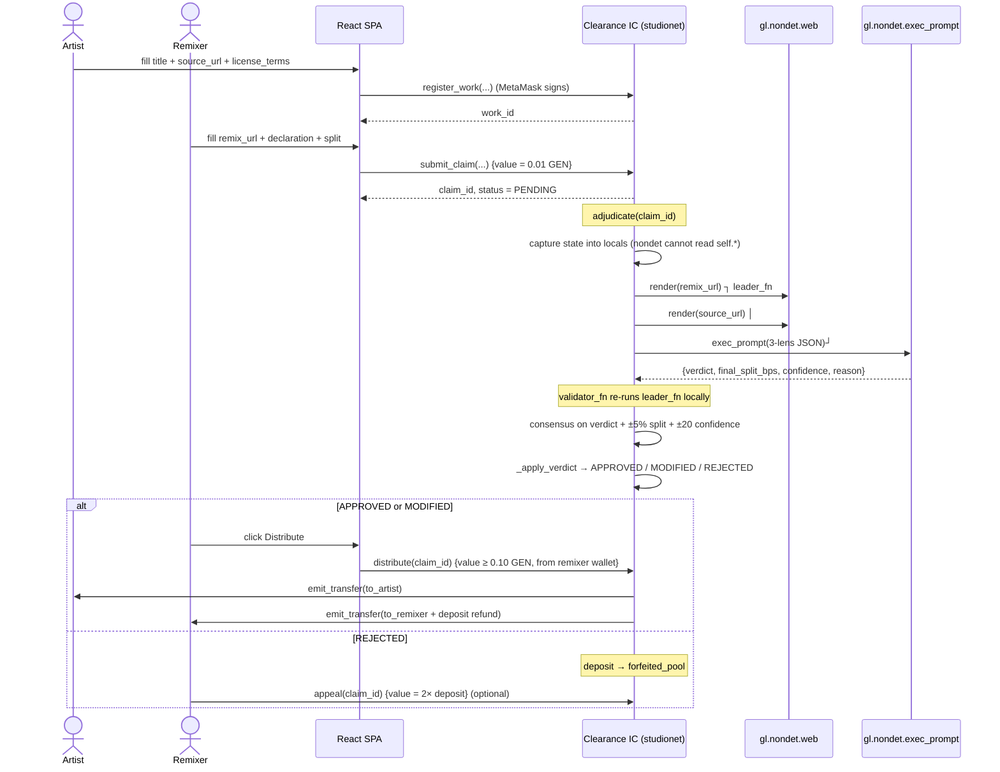

# ARCHITECTURE.md — Clearance

**Version:** v1.1.0 (2026-07-30)
**Runtime:** GenLayer Intelligent Contract on **studionet** (Chain ID `61999`).

---

## 1. System boundaries

```
┌───────────────────────────────────────────────────────────────────────┐
│                          Off-chain surface                            │
│                                                                       │
│  React + Vite SPA (frontend/)  ──►  MetaMask signs (studionet chain)  │
│         │                                                             │
│         │  genlayer-js  createClient({ chain: studionet })            │
└─────────┼─────────────────────────────────────────────────────────────┘
          ▼
┌───────────────────────────────────────────────────────────────────────┐
│                     GenLayer studionet (on-chain)                     │
│                                                                       │
│   Intelligent Contract  contracts/clearance.py                        │
│    ├─ Storage (TreeMap / DynArray / bigint / u8/u16 — no bare int)    │
│    ├─ Write:  register_work / submit_claim / adjudicate / appeal /    │
│    │          distribute / sweep_forfeited                            │
│    ├─ View:   get_work / get_claim / list_works /                     │
│    │          list_claims_for_work / get_reputation /                 │
│    │          counts / get_config                                     │
│    └─ Non-det: gl.vm.run_nondet(leader_fn, validator_fn)              │
│         ├─ gl.nondet.web.render(remix_url) ┐                          │
│         ├─ gl.nondet.web.render(source_url)│  ← public web            │
│         └─ gl.nondet.exec_prompt(prompt)   ┘  ← LLM inference         │
└───────────────────────────────────────────────────────────────────────┘
```

Frontend never holds a private key. Every write is user-signed via
MetaMask on the studionet chain (`network.ts::ensureStudionet()`).

---

## 2. Storage schema

```python
class Contract(gl.Contract):
    works:            TreeMap[str, Work]                # work_id → Work
    claims:           TreeMap[str, Claim]               # claim_id → Claim
    reputation:       TreeMap[str, Reputation]          # address → tally
    forfeited_pool:   bigint                            # sum of REJECTED deposits
    next_work_id:     bigint
    next_claim_id:    bigint
    owner:            Address
```

Storage rules (see `02-common-errors.md` R5/R14/R18/R19):

- Every `TreeMap` key is `str` (canonical lowercase 0x-hex for addresses)
  so the calldata boundary never rejects a view.
- Monetary values are `bigint`; bounded fields use `u8` (confidence,
  appeal count) and `u16` (basis points).
- All custom structs are `@allow_storage @dataclass`.
- **No `TreeMap[str, DynArray[str]]` reverse indices.** Studio's current
  build rejects `gl.storage.inmem_allocate(DynArray[str])` with
  `TypeError: _GenericAlias.__init__() missing 'args'`. Views that need
  per-artist / per-work listings scan `range(next_work_id / next_claim_id)`
  — O(n) but correct on every build. See `list_claims_for_work` and
  `list_works_by_artist`.

---

## 3. Sequence: Register → Claim → Adjudicate → Settle



---

## 4. Non-determinism contract

The adjudication block obeys three GenLayer rules:

1. **All `gl.nondet.*` calls live inside `gl.vm.run_nondet`.** No direct
   `gl.nondet.exec_prompt` from deterministic code.
2. **No storage reads inside the block.** State is captured into locals
   before entering `leader_fn`.
3. **Validator compares meaning, not schema.**
   - `verdict` must match exactly (semantic equivalence between validators).
   - For `MODIFIED`, `final_split_bps` must be within ±500 bps of the leader.
   - `confidence` must be within ±20 points.
   - If the leader output leaked `CANARY_TOKEN`, the validator refuses.

The consensus API used is `gl.vm.run_nondet` (**not**
`run_nondet_unsafe`). This gives validator-error sandboxing — a bug in
`validator_fn` surfaces distinguishably from a genuine `Disagree`, which
is what makes the appeal flow useful.

---

## 5. Frontend module map

```
frontend/src/
├── App.tsx                Router + WalletProvider
├── context/
│   └── WalletContext.tsx  MetaMask account state, autoreconnect
├── lib/
│   ├── genlayer.ts        makeClient({chain: studionet}), CONTRACT_ADDRESS
│   ├── network.ts         wallet_switchEthereumChain to studionet (chain id from SDK)
│   └── types.ts           Work / Claim / Counts (mirrors contract views)
├── components/
│   ├── ConnectWallet.tsx
│   ├── Navbar.tsx / Footer.tsx
│   ├── PendingBanner.tsx  "waiting on consensus" loading state
│   └── VerdictCard.tsx    verdict + reason + confidence + explorer link
└── pages/
    ├── Home.tsx           counters + hero + protocol lifecycle
    ├── Works.tsx          list_works
    ├── WorkDetail.tsx     get_work + list_claims_for_work
    ├── RegisterWork.tsx   register_work
    ├── SubmitClaim.tsx    submit_claim {value = 0.01 GEN}
    ├── ClaimDetail.tsx    get_claim + adjudicate + distribute + appeal
    └── MyWorks.tsx        works_by_artist for the connected wallet
```

`network.ts` reads the chain ID from `studionet.id`, not a hardcoded
constant — if GenLayer moves the chain, the app follows.

---

## 6. Security posture (see SECURITY.md for the full table)

- CEI ordering in `distribute()` — state written before external call.
- Payer enforcement (remixer only) + settlement floor + artist-share
  integrity check.
- Address canonicalisation via `_addr_str()`.
- Owner sweep of a **separate** forfeited-pool bucket — never touches
  live-claim deposits.
- Prompt-injection canary defense on inputs, prompt, and validator.
